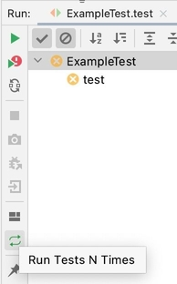
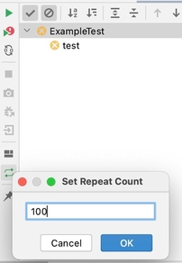

# Latskap Plugin
IntelliJ Plugin for simple way of running JUnit tests N times with no need to go 
to 'Edit Configurations...' dialog to set repeat count.
Just one button in Runner layout to repeat tests quickly.
If you often write tests with some randomized data in it you might be interested in such plugin.

## Setup & Run
* Install plugin from Jetbrains plugin marketplace
* Run test
* There is a button with plugin logo:

  
* You can set preferable repeat count to run test:

  